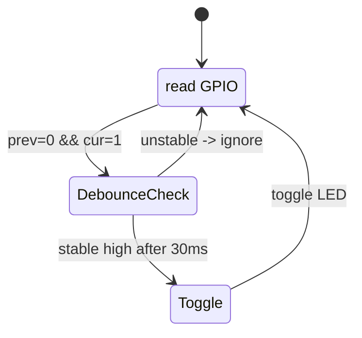
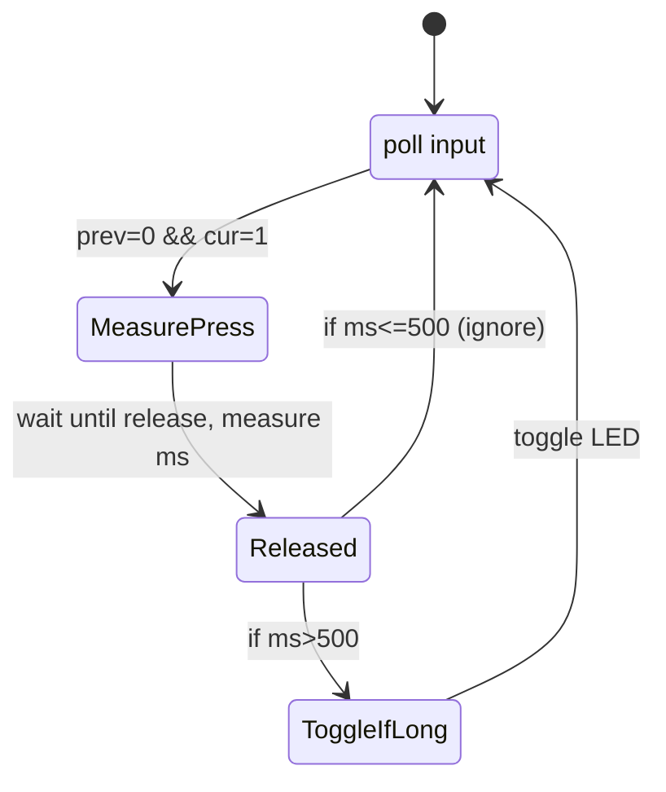
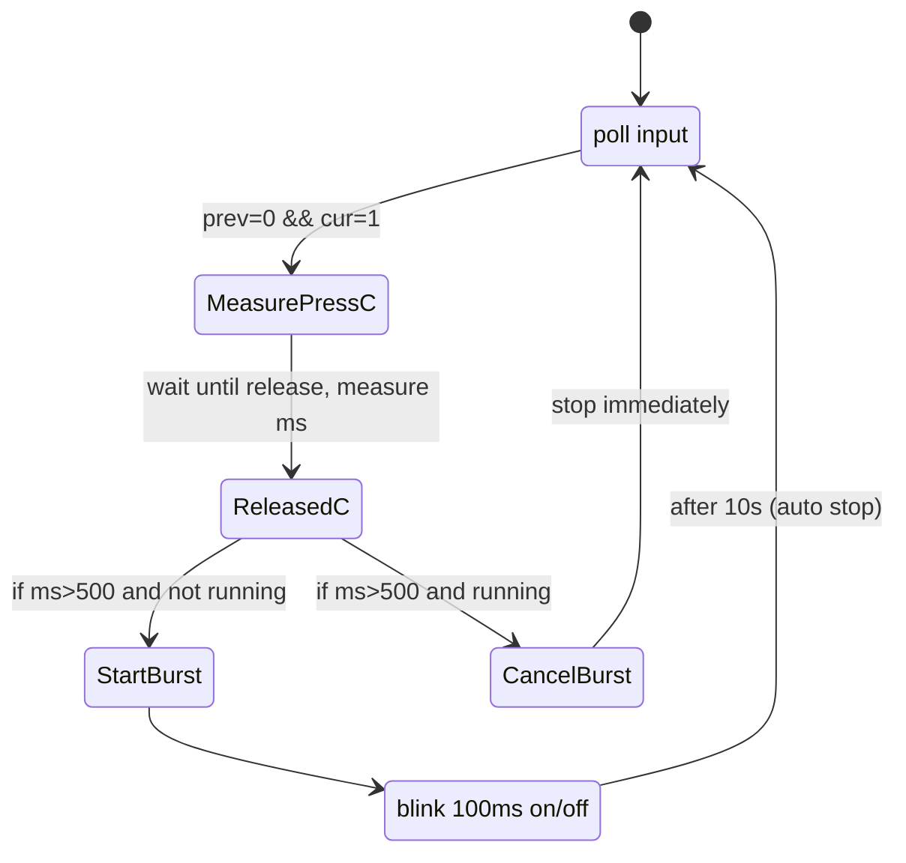

ESP32 / ESP-IDF — Manual práctico corto

Resumen
- Objetivo: instrucciones paso a paso para configurar el entorno Windows con ESP-IDF, compilar, flashear y depurar, y ejemplos prácticos de GPIO (botón + LED con debounce) compatibles con el código de `main/lab1A.c`.

1) Requisitos
- Windows 10/11.
- Conexión USB al módulo/placa (CP210x, CH340 o similar).
- 1 terminal PowerShell con privilegios de usuario normal.

2) Instalar ESP-IDF (forma recomendada en Windows)
- Descarga e instala "ESP-IDF Tools Installer" desde la web oficial: https://docs.espressif.com/projects/esp-idf/en/stable/esp-idf-get-started/
- El instalador configura Python, idf.py, toolchain y las variables de entorno.

3) Verificar instalación
- Abre el "ESP-IDF PowerShell" que proporciona el instalador (o ejecuta el script `export.ps1` que instalador mencionó).
- Ejecuta:
```powershell
idf.py --version
python --version
```
Deberías ver la versión de idf.py y una versión de Python compatible (ej. 3.10+ según release).

4) Drivers USB-Serial
- Verifica en Device Manager que al conectar la placa aparece un puerto COM (ej. COM5).
- Instala drivers CP210x o CH340 si no aparece el puerto.

5) Comandos básicos (PowerShell, desde la carpeta del proyecto)
- Desde `C:\Users\pauca\Desktop\SEU\Lab1`:
```powershell
# Compilar
idf.py build
# Flash (ajusta COM según tu máquina)
idf.py -p COM5 flash
# Monitor (serial)
idf.py -p COM5 monitor
# Flash y abrir monitor
idf.py -p COM5 flash monitor
```
- Para salir del monitor: Ctrl+].

6) VS Code (recomendado)
- Instala la extensión "ESP-IDF" (Espressif) en VS Code.
- Abre la carpeta del proyecto y usa la paleta (Ctrl+Shift+P) -> "ESP-IDF: Configure ESP-IDF extension" y luego "ESP-IDF: Monitor" o "Build, Flash and Monitor".

7) Aspectos de GPIO importantes
- Pines de boot/strapping: GPIO0, GPIO2, GPIO15, etc. (depende del SoC) tienen funciones al arranque. Evita usar GPIO0 como entrada con hardware que mantingui a GND durant el reset si vols flashejar fàcilment; moltes plaques vinculen un botó a GPIO0 per entrar en boot mode.
- Pull-ups / pull-downs: configura internament amb `gpio_config()` o usa resistències externes. Decide si el botó és actiu-alt (pulldown) o actiu-baix (pullup).
- Nivells: `gpio_set_level(pin, 1)` => alto (3.3V), `0` => bajo (0V).

8) Ejemplo robusto: botón + LED con debounce
- Explicación: Detectamos flanco estable (0->1 ó 1->0 según wiring) con debounce software de 30 ms.
- Código de ejemplo (C, ESP-IDF, sustituye botones/pines si es necesario):
```c
#include <stdbool.h>
#include "freertos/FreeRTOS.h"
#include "freertos/task.h"
#include "driver/gpio.h"
#include "esp_log.h"

#define INPUT_GPIO   GPIO_NUM_0  // Cambia según tu cableado
#define OUTPUT_GPIO  GPIO_NUM_4

static const char *TAG = "lab1A_debounce";

void app_main(void)
{
    // Config LED output
    gpio_config_t io_out = {
        .pin_bit_mask = 1ULL << OUTPUT_GPIO,
        .mode = GPIO_MODE_OUTPUT,
        .pull_up_en = GPIO_PULLUP_DISABLE,
        .pull_down_en = GPIO_PULLDOWN_DISABLE,
        .intr_type = GPIO_INTR_DISABLE,
    };
    gpio_config(&io_out);

    // Config input with internal pull-down (change to pull-up si el botón va a GND)
    gpio_config_t io_in = {
        .pin_bit_mask = 1ULL << INPUT_GPIO,
        .mode = GPIO_MODE_INPUT,
        .pull_up_en = GPIO_PULLUP_DISABLE,
        .pull_down_en = GPIO_PULLDOWN_ENABLE,
        .intr_type = GPIO_INTR_DISABLE,
    };
    gpio_config(&io_in);

    bool led = false;
    gpio_set_level(OUTPUT_GPIO, led);

    int prev = gpio_get_level(INPUT_GPIO);

    while (1) {
        int cur = gpio_get_level(INPUT_GPIO);
        if (prev == 0 && cur == 1) {
            // posible flanco de pujada -> debounce
            vTaskDelay(pdMS_TO_TICKS(30));
            cur = gpio_get_level(INPUT_GPIO);
            if (cur == 1) {
                led = !led;
                gpio_set_level(OUTPUT_GPIO, led);
                ESP_LOGI(TAG, "Button press: LED %s", led?"ON":"OFF");
            }
        }
        prev = cur;
        vTaskDelay(pdMS_TO_TICKS(10));
    }
}
```
- Si tu botón es activo-baix (pulled-up): configura `.pull_up_en = GPIO_PULLUP_ENABLE` y detecta `prev == 1 && cur == 0`.

9) Pruebas hardware rápidas
- Parpadeo de inicio: pon un pequeño test que haga 3 parpadeos al arrancar para confirmar wiring del LED.
- Forzar LED ON: si quieres verificar salida sin botón, enciende el LED permanentemente con `gpio_set_level(OUTPUT_GPIO, 1);`.

10) Debug y problemas comunes
- "driver/gpio.h" no encontrado: añade `driver` en `main/CMakeLists.txt` PRIV_REQUIRES o revisa tu include paths:
```cmake
idf_component_register(SRCS "hello_world_main.c"
                       PRIV_REQUIRES spi_flash driver
                       INCLUDE_DIRS "")
```
- Error "port busy": otra aplicación usa COM (cerrar otros programas que usen el puerto).
- Si la placa no arranca tras flashear: asegúrate de respetar strapping pins i que no estigui bloquejat en mode boot per un botó premut (GPIO0 a GND).

11) Recursos y referencias
- Documentación oficial ESP-IDF: https://docs.espressif.com/projects/esp-idf/en/stable/
- GUI/IDE: VS Code + extension ESP-IDF
- Ejemplos de ESP-IDF: inside your IDF install under `examples/`

12) Checklist mínimo para compilar y probar
- [ ] Tener ESP-IDF instalado y `idf.py` disponible
- [ ] Conectar placa y confirmar COM en Device Manager
- [ ] `idf.py build` → sin errores
- [ ] `idf.py -p COMx flash monitor` → ver logs
- [ ] Comprobar parpadeo inicial / mensajes
- [ ] Probar botón y observar toggles

Si quieres, creo un fichero `main/lab1A_debounce.c` con la versión de ejemplo y lo añado al proyecto; o te guío paso a paso para instalar ESP-IDF en tu Windows y compilar desde VS Code.

-- Fin del manual breve

## Diagramas (Mermaid)

### lab1A.c — Toggle en flanc de pujada (polling)



### lab1B.c — Toggle solo si pulsación >0.5s



### lab1C.c — Long press inicia burst 10s; otro long press cancela



### hello_world_main.c — versió de prova i toggle simple

```mermaid
flowchart TD
  Start[Start app_main]
  Init[Init GPIOs: BUTTON(GPIO0), LED(GPIO4)]
  BlinkTest[Do 3x LED blink test]
  Loop[Main polling loop]
  Read[Read BUTTON]
  Rising{Prev=0 && Cur=1?}
  Debounce[Delay 20-30ms and re-read]
  Toggle[Toggle LED]
  Start --> Init --> BlinkTest --> Loop
  Loop --> Read --> Rising
  Rising -->|yes| Debounce -->|stable| Toggle --> Loop
  Rising -->|no| Loop
```
